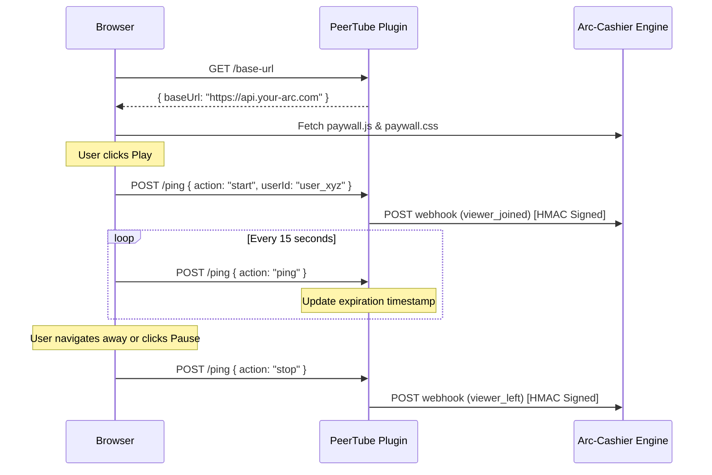

# peertube-plugin-arc-cashier

<div align="center">
  
  
  
  =18-yellow?style=for-the-badge" alt="Node Version">
  <br>
  
  
  
</div>

*Official PeerTube companion plugin for Arc-Cashier enabling high-fidelity per-second billing.*

> **TL;DR:** Injects the Arc-Cashier paywall directly into the PeerTube player and tracks user watch time via continuous server pings. This enables a seamless per-second billing integration for decentralized video hosting.

---

## 🔗 What is Arc-Cashier?

> [!WARNING]
> **Companion Plugin Only**
> This plugin does not process payments or manage blockchain transactions by itself. It is specifically built as a **companion bridge** for Arc-Cashier.

[**Arc-Cashier**](https://github.com/JaDi03/Arc-Cashier) is an open-source sidecar billing engine that enables Web3 per-second streaming payments (using Circle USDC) for self-hosted platforms. 

To use this PeerTube plugin, you **MUST** have an instance of Arc-Cashier running. The plugin acts as a reporter, sending high-fidelity presence webhooks (`viewer_joined`, `viewer_left`) to your Arc-Cashier backend, which then handles all the actual billing logic and paywall asset delivery.

---

## Table of Contents
- [Key Features](#-key-features)
- [How It Works](#-how-it-works)
- [Packaging & Installation](#-packaging--installation)
- [Project Structure](#-project-structure)
- [Tech Stack](#-tech-stack)
- [License](#-license)

---

## 🌟 Key Features
- **Zero Assumptions Architecture**: Automatically resolves the base URL from the webhook configuration to fetch `paywall.js` and `paywall.css` dynamically from your Arc-Cashier node.
- **High-Fidelity Tracking**: Connects to HTML5 video events (`play`, `pause`, `ended`) and emits reliable periodic pings every 15 seconds to ensure millimeter precision in billing.
- **Secure Webhooks**: Signs all HTTP event requests sent to Arc-Cashier using HMAC SHA-256 via the `X-PeerTube-Signature` header to prevent spoofing.
- **Resilient State Management**: Backend memory timeouts ensure users are correctly marked as disconnected even if their browser crashes or loses internet connection abruptly.
- **SPA Navigation Ready**: Gracefully handles PeerTube's Single Page Application architecture, showing and hiding the paywall correctly as users navigate between the dashboard and the video watch pages.

---

## 🧠 How It Works

This plugin consists of two main pieces: a server-side route for configuration and webhook dispatching, and a client script injected directly into the user's browser.



---

## 🎥 Proof of Concept

**PeerTube Integration (Viewer Flow)**  
<video src="media/test-peer-compressed.mp4" controls autoplay loop muted playsinline width="100%"></video>

**Backend Verification & On-Chain Settlement**  
While the viewer watches the PeerTube video, the companion Arc-Cashier backend silently validates x402 signatures every second. Once the viewer leaves, the unused balance is instantly refunded on the Arc Testnet via Circle CCTP.

<p align="center">
  
  &nbsp;
  
</p>
<p align="center">
  
  &nbsp;
  
</p>

---

## 📦 Packaging & Installation

To install this plugin on a production PeerTube instance, you first need to package it into an installable `.tgz` bundle.

### 1. Build and Package
Run these commands on your local machine to compile the TypeScript and generate the tarball:

```bash
git clone https://github.com/JaDi03/peertube-plugin-arc-cashier.git
cd peertube-plugin-arc-cashier
npm install
npm run build
npm pack
```

*The `npm pack` command will generate a file named something like `peertube-plugin-arc-cashier-1.0.9.tgz` in your current directory.*

### 2. Install on PeerTube
1. Log in to your PeerTube instance as an **Administrator**.
2. Navigate to **Administration** -> **Plugins/Themes**.
3. Go to the **Install** tab.
5. Click **Browse...** and select the `.tgz` file you generated in Step 1.
6. Click **Install**.

### 3. Docker CLI Installation (Advanced / Headless)
If you are developing locally with PeerTube running inside a Docker container (like `docker-peertube-peertube-1`), or if the plugin upload UI is unavailable, you can install the plugin directly via the terminal:

1. **Build and Pack locally**:
   ```bash
   npm run build
   npm pack
   ```

2. **Transfer the `.tgz` to the Docker Container**:
   ```bash
   # Remove old temp files first (if any)
   docker exec docker-peertube-peertube-1 sh -c "rm -rf /tmp/peertube-plugin-arc-cashier /tmp/peertube-plugin-arc-cashier-*.tgz"
   
   # Copy the new tarball generated by npm pack
   docker cp peertube-plugin-arc-cashier-1.0.9.tgz docker-peertube-peertube-1:/tmp/
   ```

3. **Extract and Install via PeerTube CLI**:
   ```bash
   docker exec docker-peertube-peertube-1 sh -c "
     mkdir -p /tmp/peertube-plugin-arc-cashier && 
     tar -xzf /tmp/peertube-plugin-arc-cashier-1.0.9.tgz -C /tmp/peertube-plugin-arc-cashier --strip-components=1 &&
     npm run plugin:install -- --plugin-path /tmp/peertube-plugin-arc-cashier
   "
   ```

4. **Restart PeerTube** (To force the backend to load the new plugin code):
   ```bash
   docker restart docker-peertube-peertube-1
   ```
   
> **Note for Updates:** If you are updating an already installed plugin, you must run the uninstall command first before step 3:
> `docker exec docker-peertube-peertube-1 node dist/scripts/plugin/uninstall.js --npm-name peertube-plugin-arc-cashier`

### 3. Configuration
Once installed, click on the **Settings** button next to the plugin to configure the connection to your Arc-Cashier server:
- **WebhookUrl**: The full API route of your Arc-Cashier instance (e.g., `https://api.yourdomain.com/api/connectors/peertube/webhook`).
- **WebhookSecret**: The cryptographically secure string matching your `.env` configuration in Arc-Cashier (`PEERTUBE_WEBHOOK_SECRET`).

---

## 🏗️ Project Structure

```text
peertube-plugin-arc-cashier/
├── .github/workflows/       # CI pipelines
├── src/
│   ├── client.ts            # Client-side injected logic (Paywall & Pings)
│   └── main.ts              # Server-side routing and Webhook signing
├── dist/                    # Compiled esbuild and tsc distribution files
├── package.json             # Plugin metadata, scopes, and dependencies
└── tsconfig.json            # TypeScript configuration
```

---

## 🛠️ Tech Stack
- **[TypeScript](https://www.typescriptlang.org/)**: Strongly typed programming language.
- **[Node.js](https://nodejs.org/)**: Server environment.
- **[esbuild](https://esbuild.github.io/)**: Blazing fast JS bundler used to output ESM modules for the client.
- **[PeerTube Types](https://github.com/Chocobozzz/PeerTube)**: Official typing definitions for the PeerTube API.

---

## 📄 License
Apache-2.0
