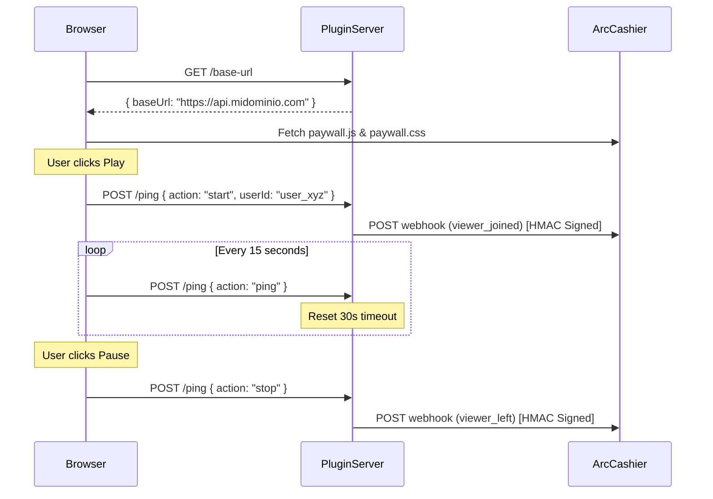

# peertube-plugin-arc-cashier

<div align="center">
  
  
  
  =18-yellow?style=for-the-badge" alt="Node Version">
  <br>
  
  
  
</div>

*Official PeerTube plugin for Arc-Cashier enabling high-fidelity per-second billing.*

> **TL;DR:** Injects the Arc-Cashier paywall directly into the PeerTube player and tracks user watch time via continuous server pings. This enables a seamless per-second billing integration for decentralized video hosting.

---

## Table of Contents
- [Key Features](#key-features)
- [How It Works](#how-it-works)
- [Quick Start](#quick-start)
- [Project Structure](#project-structure)
- [Tech Stack](#tech-stack)
- [License](#license)

## Key Features
- **Dynamic Asset Injection**: Automatically resolves the base URL from the webhook configuration to fetch `paywall.js` and `paywall.css`.
- **High-Fidelity Tracking**: Connects to HTML5 video events (`play`, `pause`, `ended`) and emits reliable periodic pings every 15 seconds.
- **Secure Webhooks**: Signs all events sent to Arc-Cashier (`viewer_joined`, `viewer_left`) using HMAC SHA-256 (`X-PeerTube-Signature`).
- **Resilient State Management**: In-memory timeout mapping ensures users are marked as disconnected even if they close their browser abruptly.

## How It Works
The plugin consists of a server-side route for configuration and webhook dispatching, and a client script that binds to the video player.



1. The client script requests the base URL from the plugin server.
2. It dynamically injects the required frontend assets into the DOM.
3. Upon video interaction, the client begins sending pings.
4. The plugin server constructs and signs webhooks directed at Arc-Cashier.

## Quick Start

### Prerequisites
- Node.js >= 18.0.0
- PeerTube >= 6.0.0

### Installation
```bash
git clone https://github.com/JaDi03/peertube-plugin-arc-cashier.git
cd peertube-plugin-arc-cashier
npm install
npm run build
```

### Deployment
1. Build the distribution folder using `npm run build`.
2. Install the plugin in your PeerTube instance using the PeerTube CLI or Admin panel.
3. In the PeerTube Admin Settings > Plugins, configure the `WebhookUrl` and `WebhookSecret`.

## Project Structure
```text
peertube-plugin-arc-cashier/
├── .github/workflows/       # CI pipelines
├── src/
│   ├── client.ts            # Client-side injected logic
│   └── main.ts              # Server-side routing and webhook dispatch
├── dist/                    # Compiled distribution files
├── package.json             # Plugin metadata and dependencies
└── tsconfig.json            # TypeScript configuration
```

## Tech Stack
- **[TypeScript](https://www.typescriptlang.org/)**: Strongly typed programming language.
- **[Node.js](https://nodejs.org/)**: Server environment.
- **[PeerTube Types](https://github.com/Chocobozzz/PeerTube)**: Official typing definitions for the PeerTube API.

## License
Apache-2.0
