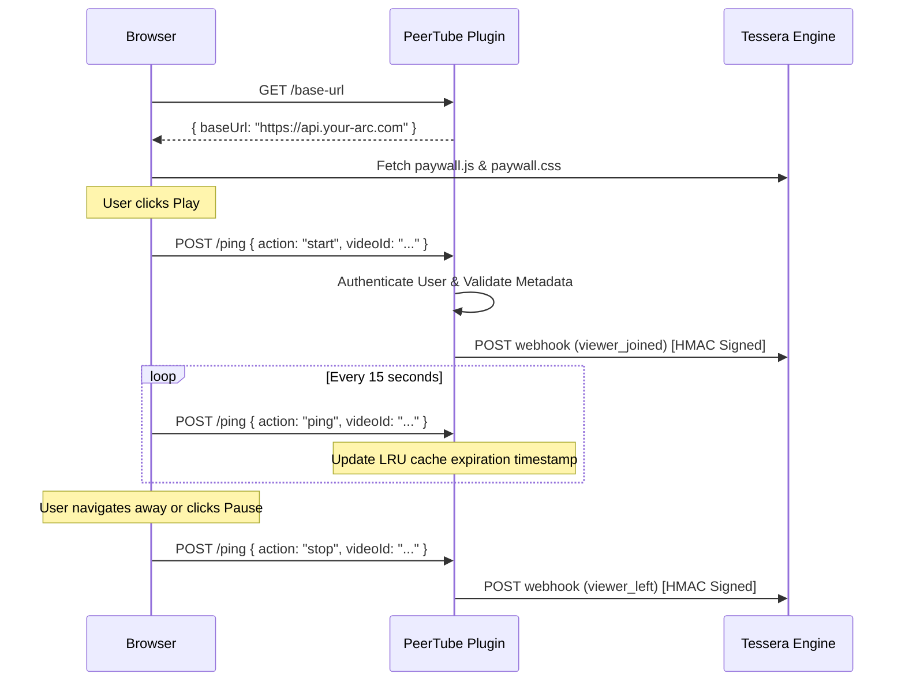
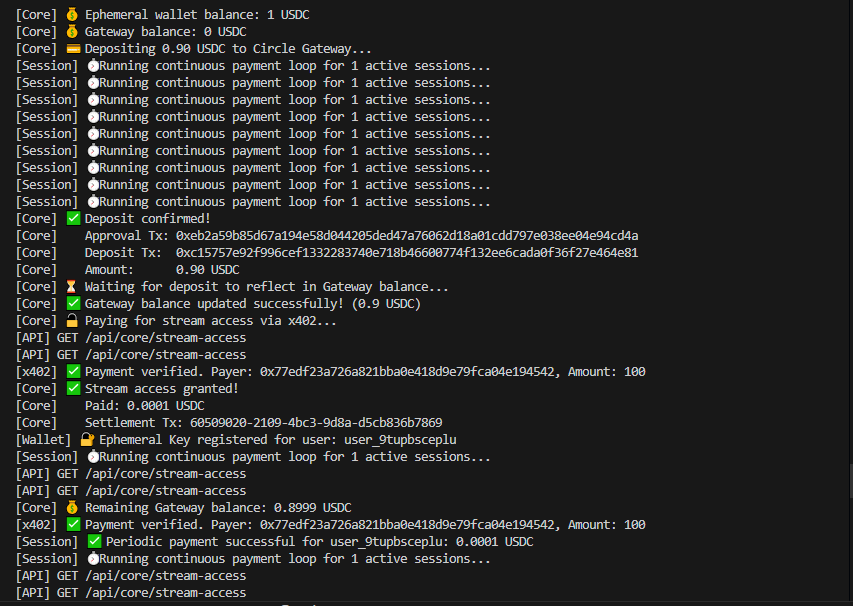
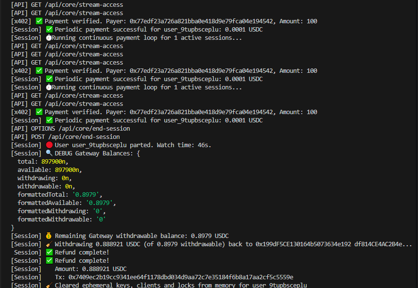
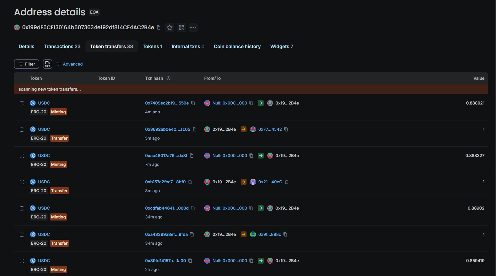
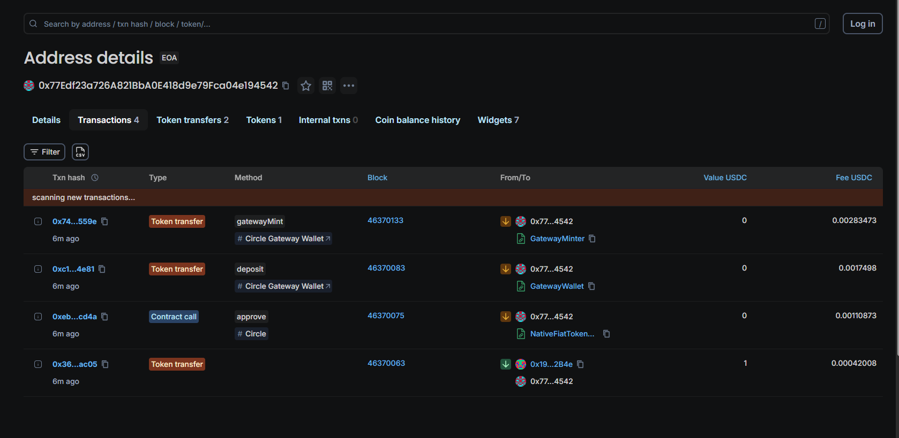

# peertube-plugin-tessera

<div align="center">
  <!-- Row 1: Status Badges -->
  
  
  
  =18-yellow?style=for-the-badge" alt="Node Version">
  <br>
  <!-- Row 2: Tech Stack Badges -->
  
  
  
</div>

*Official PeerTube companion plugin for Tessera enabling high-fidelity per-second billing.*

> **TL;DR:** Injects the Tessera paywall directly into the PeerTube player and tracks user watch time via continuous server pings. This enables a seamless per-second billing integration for decentralized video hosting.

---

## 🔗 What is Tessera?

> [!WARNING]
> **Companion Plugin Only**
> This plugin does not process payments or manage blockchain transactions by itself. It is specifically built as a **companion bridge** for Tessera.

[**Tessera**](https://github.com/JaDi03/Tessera) is an open-source sidecar billing engine that enables Web3 per-second streaming payments (using Circle USDC) for self-hosted platforms. 

To use this PeerTube plugin, you **MUST** have an instance of Tessera running. The plugin acts as a reporter, sending high-fidelity presence webhooks (`viewer_joined`, `viewer_left`) with complete video metadata to your Tessera backend, which then handles all the actual billing logic and paywall asset delivery.

---

## Table of Contents
- [Key Features](#-key-features)
- [How It Works](#-how-it-works)
- [Proof of Concept](#-proof-of-concept)
- [Quick Start](#-quick-start)
- [Project Structure](#-project-structure)
- [Production & Architecture (V1)](#-production--architecture-v1)
- [Tech Stack](#-tech-stack)
- [License](#-license)

---

## 🌟 Key Features
- **Native Authentication Integration**: Automatically derives a deterministic, spoof-proof user ID securely hashed via HMAC SHA-256 using PeerTube's native `getAuthUser` session logic.
- **Rich Metadata Webhooks**: Sends detailed context in every webhook, including `videoId`, `channelId`, `videoUrl`, and `instanceUrl` for accurate creator attribution.
- **Robust Event Tracking**: Binds to HTML5 video events (`play`, `pause`, `ended`) via a strict `AbortController` to prevent memory leaks, stopping billing instantly when the user pauses.
- **DDoS & Memory Protection**: Enforces an adjustable Least Recently Used (LRU) cache policy on active viewers and internal rate limiting on the `/ping` route.
- **SPA Navigation Ready**: Gracefully handles PeerTube's Single Page Application architecture, showing and hiding the paywall dynamically.

---

## 🧠 How It Works

This plugin consists of two main pieces: a server-side route for configuration and webhook dispatching, and a client script injected directly into the user's browser.



1. **Initialization**: The client script fetches the paywall assets directly from the remote Tessera instance.
2. **Session Start**: When playback begins, a ping is sent to the plugin server, which authenticates the user natively and emits a HMAC-signed webhook to Tessera.
3. **Tracking**: Pings maintain the user session active. The server limits request rates to prevent abuse.
4. **Session End**: Navigating away, pausing, or closing the tab causes a final `stop` ping or a garbage-collection timeout to safely notify Tessera.

---

## 📸 Proof of Concept

**PeerTube Integration (Viewer Flow)**  

https://github.com/user-attachments/assets/efba151f-25e5-4e4c-9669-6191a2d7b600

**Backend Verification & On-Chain Settlement**  
While the viewer watches the PeerTube video, the companion Tessera backend silently validates x402 signatures every second. Once the viewer leaves, the unused balance is instantly refunded on the Arc Testnet via Circle CCTP.

<p align="center">
  
  &nbsp;
  
</p>
<p align="center">
  
  &nbsp;
  
</p>

[🔍 View Ephemeral Wallet Transactions on Arcscan Testnet](https://testnet.arcscan.app/address/0x77Edf23a726A821BbA0E418d9e79Fca04e194542?tab=txs)

---

## 🚀 Quick Start

To install this plugin on a production PeerTube instance, you first need to package it into an installable `.tgz` bundle.

### Prerequisites
- [Node.js](https://nodejs.org/) v18+
- An operational [PeerTube](https://joinpeertube.org/) instance

### 1. Build and Package
Run these commands on your local machine to compile the TypeScript and generate the tarball:

```bash
git clone https://github.com/JaDi03/peertube-plugin-tessera.git
cd peertube-plugin-tessera
npm install
npm run build
npm pack
```

### 2. Install on PeerTube
1. Log in to your PeerTube instance as an **Administrator**.
2. Navigate to **Administration** -> **Plugins/Themes**.
3. Go to the **Install** tab.
4. Click **Browse...** and select the `.tgz` file generated.
5. Click **Install**.

### 3. Docker CLI Installation (Advanced / Headless)
If you are developing locally with Docker (`docker-peertube-peertube-1`):

```bash
# 1. Build locally
npm run build && npm pack

# 2. Transfer tarball
docker exec docker-peertube-peertube-1 sh -c "rm -rf /tmp/peertube-plugin-tessera*"
docker cp peertube-plugin-tessera-1.0.10.tgz docker-peertube-peertube-1:/tmp/

# 3. Extract and Install
docker exec docker-peertube-peertube-1 sh -c "
  mkdir -p /tmp/peertube-plugin-tessera && 
  tar -xzf /tmp/peertube-plugin-tessera-1.0.10.tgz -C /tmp/peertube-plugin-tessera --strip-components=1 &&
  npm run plugin:install -- --plugin-path /tmp/peertube-plugin-tessera
"

# 4. Restart PeerTube
docker restart docker-peertube-peertube-1
```

### 4. Configuration
Once installed, click on the **Settings** button next to the plugin to configure the connection:
- **WebhookUrl**: The full API route of your Tessera instance (e.g., `https://api.yourdomain.com/api/connectors/peertube/webhook`).
- **WebhookSecret**: The cryptographically secure string matching your `.env` configuration in Tessera.
- **Max Active Viewers**: Soft limit for concurrent active memory sessions (Default: `10000`) to enforce LRU cache boundaries.
- **Base Rate Per Second**: The default payment rate in USDC for videos that do not have a specific price set (e.g., `0.0001`).

### 5. Per-Video Monetization Settings
You can override the global billing settings on a per-video basis. When uploading or editing a video, look for the **Plugin Settings** tab to configure:
- **Tessera Monetization Mode**: Choose between `⚡ Pay-per-second` or `💝 Tips (free to watch)`.
- **Rate per second (USDC)**: Set a custom price for this specific video.

---

## 🏗️ Project Structure

```text
peertube-plugin-tessera/
├── .github/workflows/       # CI pipelines
├── src/
│   ├── client.ts            # Client-side injected logic (Paywall & Events)
│   └── main.ts              # Server-side routing, LRU Cache, and Webhooks
├── dist/                    # Compiled esbuild and tsc distribution files
├── tests/                   # Vitest unit test suite
├── package.json             # Plugin metadata, scopes, and dependencies
└── tsconfig.json            # TypeScript configuration
```

---

## 🏭 Production & Architecture (V1)

To ensure high availability and prevent abuse in decentralized environments, the following architectural constraints have been established:

- **LRU Memory Protection**: The plugin limits active sessions in memory using the `max-active-viewers` setting. Older inactive sessions are automatically evicted if a surge occurs, prioritizing new connections while performing best-effort `viewer_left` notifications.
- **Rate Limiting**: To prevent DDoS on the plugin's internal `/ping` router, the backend enforces a hard limit of 1 ping every 5 seconds per authenticated user.
- **Ghost Session Collection**: The internal garbage collector awaits confirmation from the Tessera webhook before removing a session from memory. If the connection fails, it defers removal to retry on the next cycle, ensuring no billing session is left stranded indefinitely.
- **💸 Transparent Limitations**: 
  - Unauthenticated users will hit a `401 Unauthorized` block on `/ping`. This effectively locks them out of paid content natively.
  - Relying exclusively on HTTP webhooks means that if the Tessera server suffers extended downtime, PeerTube's memory buffer may fill up and evict sessions without final billing confirmation. It is crucial to maintain high uptime on the Tessera end.

---

## 🛠️ Tech Stack
- **[TypeScript](https://www.typescriptlang.org/)**: Strongly typed programming language.
- **[Node.js](https://nodejs.org/)**: Server environment.
- **[esbuild](https://esbuild.github.io/)**: Blazing fast JS bundler used to output ESM modules for the client.
- **[Vitest](https://vitest.dev/)**: Next-generation testing framework.
- **[PeerTube Types](https://github.com/Chocobozzz/PeerTube)**: Official typing definitions for the PeerTube API.

---

## 📄 License
Apache-2.0
