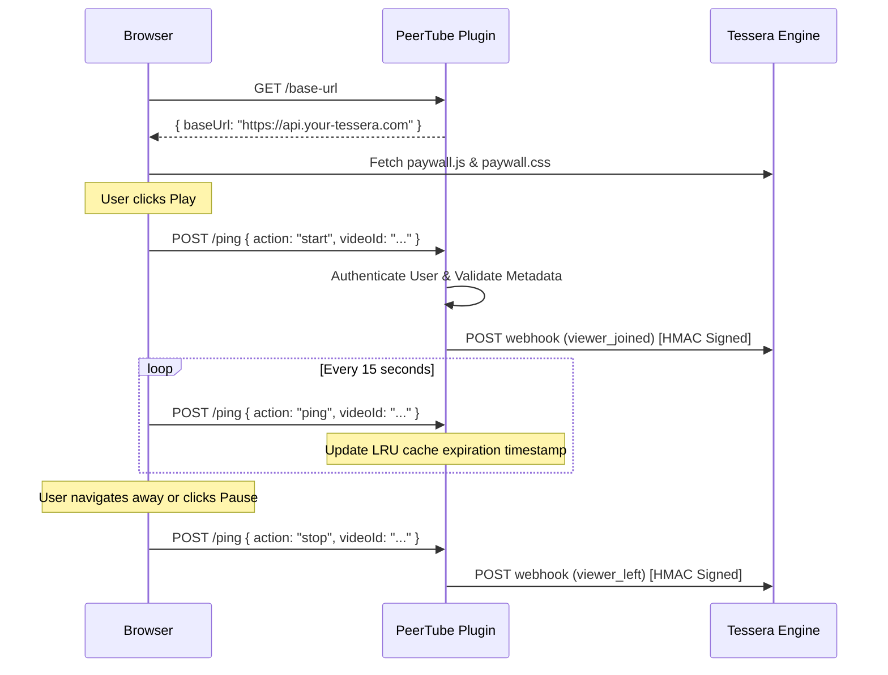
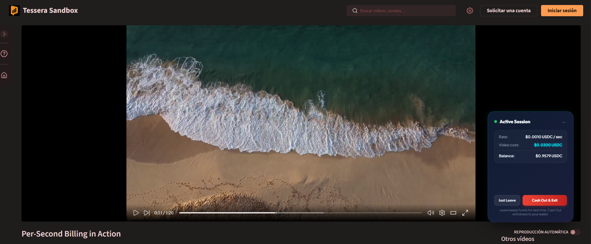
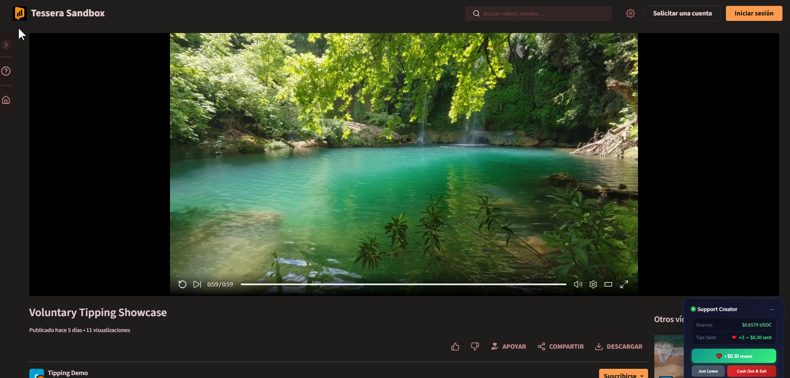

# PeerTube Tessera Plugin

<div align="center">
  <!-- Row 1: Status Badges -->
  
  
  
  =18-339933?style=for-the-badge" alt="Node Version">
  <br>
  <!-- Row 2: Tech Stack Badges -->
  
  
</div>

---

**PeerTube Guide**: [https://jadi03.github.io/tessera/platforms/peertube/](https://jadi03.github.io/tessera/platforms/peertube/)

**Main Sidecar Repository**: [https://github.com/JaDi03/tessera](https://github.com/JaDi03/tessera)

**Live Playground**: [https://try-tessera.xyz](https://try-tessera.xyz)

---

*Official PeerTube companion plugin for the Tessera monetization sidecar.*

> **TL;DR:** Injects the Tessera paywall directly into the PeerTube player interface and tracks viewer watch-time. It sends HMAC-signed webhooks to the Tessera sidecar, enabling seamless pay-per-second streams and voluntary tipping.

---

## Companion Architecture

> [!WARNING]
> **Companion Plugin Only**
> This plugin does not process payments or manage blockchain transactions by itself. It is specifically built as a companion bridge for Tessera.

To use this PeerTube plugin, you must have an instance of Tessera running (see the [Tessera Quick Start Guide](https://jadi03.github.io/tessera/getting-started/)). The plugin acts as a reporter, sending high-fidelity presence webhooks (viewer_joined, viewer_left) with complete video metadata to your Tessera backend, which then handles all the actual billing logic and paywall asset delivery.

---

## Table of Contents
- [Key Features](#key-features)
- [How It Works](#how-it-works)
- [Proof of Concept / Demo](#proof-of-concept--demo)
- [Quick Start](#quick-start)
- [Project Structure](#project-structure)
- [Technical Safety Limits](#technical-safety-limits)
- [License](#license)

---

## Key Features

*   **Anonymous and Guest Support:** Viewers do not need to register or log into the PeerTube instance to watch premium videos or send tips. Payment session keys are managed directly by the paywall client, minimizing onboarding friction and maximizing creator revenue.
*   **Zero-Configuration Paywall Injection:** Embeds the payment overlay directly inside the native HTML5 player.
*   **HMAC SHA-256 Webhooks:** All backend requests from the plugin server to Tessera are cryptographically signed to prevent spoofing.
*   **Native Admin Authentication:** Uses PeerTube's native `getAuthUser` session logic to securely restrict the platform fee balance and withdrawal endpoints to instance administrators only.
*   **Abort-Safe Event Binding:** Listens to video playback states (play, pause, ended) securely, preventing memory leaks and stopping the meter instantly when playback pauses.
*   **LRU Cache Protection:** Enforces memory limits on the PeerTube instance to protect the host server from DDoS.

---

## How It Works


```mermaid
sequenceDiagram
    participant Browser
    participant PluginServer as PeerTube Plugin
    participant TesseraEngine as Tessera Engine
    
    Browser->>PluginServer: GET /base-url
    PluginServer-->>Browser: { baseUrl: "https://api.your-tessera.com" }
    Browser->>TesseraEngine: Fetch paywall.js & paywall.css
    
    Note over Browser: User clicks Play
    Browser->>PluginServer: POST /ping { action: "start", videoId: "..." }
    PluginServer->>PluginServer: Authenticate User & Validate Metadata
    PluginServer->>TesseraEngine: POST webhook (viewer_joined) [HMAC Signed]
    
    loop Every 15 seconds
        Browser->>PluginServer: POST /ping { action: "ping", videoId: "..." }
        Note over PluginServer: Update LRU cache expiration timestamp
    end
    
    Note over Browser: User navigates away or clicks Pause
    Browser->>PluginServer: POST /ping { action: "stop", videoId: "..." }
    PluginServer->>TesseraEngine: POST webhook (viewer_left) [HMAC Signed]
```

1.  **Asset Retrieval:** The client player fetches the paywall UI directly from the Tessera instance URL.
2.  **Webhook Trigger:** On video play, the plugin server validates the metadata and issues a signed webhook to Tessera.
3.  **Active Keep-Alive:** Pings sent from the client every 15 seconds update the memory cache.
4.  **Session Terminate:** Pausing, ending, or closing the tab immediately triggers a stop event, settling the payment on-chain.

---

## Proof of Concept / Demo

Here is how the PeerTube player interface looks during active session monetization and tipping:

### Pay-Per-Second Monetization


### Tipping Overlay


---

## Quick Start

### Option A: Automated Installation (Docker/VPS)
We provide an automated build and deploy script that targets the PeerTube container directly:

```bash
git clone https://github.com/JaDi03/peertube-plugin-tessera.git
cd peertube-plugin-tessera
chmod +x update-plugin.sh
./update-plugin.sh
```

### Option B: Manual Packaging (Web UI)
If you prefer installing via the PeerTube Web Console:

1.  Build the tarball:
    ```bash
    git clone https://github.com/JaDi03/peertube-plugin-tessera.git
    cd peertube-plugin-tessera
    npm install && npm run build
    npm pack
    ```
2.  Log in to PeerTube as an Administrator.
3.  Go to **Administration** > **Plugins/Themes** > **Install** tab.
4.  Upload the generated `.tgz` file and click **Install**.

---

## Configuration

Once installed, configure the plugin settings in the administration dashboard. For a detailed step-by-step walkthrough of both admin and creator monetization settings, refer to the [PeerTube Configuration Guide](https://jadi03.github.io/tessera/platforms/peertube/configuration/):
*   **Tessera Base URL:** The public API URL of your sidecar (e.g., `https://tessera.yourdomain.com`).
*   **Tessera Webhook URL:** The full webhook endpoint where PeerTube events are sent (e.g., `https://tessera.yourdomain.com/api/connectors/peertube/webhook`).
*   **Tessera Webhook Secret:** The `PEERTUBE_WEBHOOK_SECRET` matching your sidecar's `.env` configuration.
*   **Max Active Viewers:** Soft memory cap (Default: `10000`) for session cache eviction.
*   **Admin Wallet (Arc Network):** The public address where platform fee splits are routed.

---

## Project Structure

```text
peertube-plugin-tessera/
├── .github/workflows/       # CI pipelines
├── src/
│   ├── client.ts            # Client-side injected logic (Paywall & Events)
│   └── main.ts              # Server-side routing, LRU Cache, and Webhooks
├── dist/                    # Compiled distribution files
├── tests/                   # Vitest unit test suite
├── package.json             # Plugin metadata and dependencies
└── tsconfig.json            # TypeScript configuration
```

---

## Technical Safety Limits

To ensure high availability and prevent abuse in decentralized environments, the following safety constraints have been established:

*   **LRU Memory Protection:** The plugin limits active sessions in memory. Older inactive sessions are automatically evicted if a surge occurs, prioritizing new connections while performing best-effort disconnect notifications.
*   **Rate Limiting:** To prevent abuse on the plugin's internal ping router, the backend enforces a limit of 1 ping every 2 seconds per session.
*   **Ghost Session Collection:** The internal garbage collector awaits confirmation from the Tessera webhook before removing a session from memory. If the connection fails, it defers removal to retry on the next cycle.
*   **Transparent Limitations:**
    *   Unauthenticated users will hit a `401 Unauthorized` block. This locks them out of paid content natively.
    *   If the Tessera sidecar suffers extended downtime, PeerTube's memory buffer may fill up and evict sessions without final billing confirmation. High uptime on the Tessera sidecar is recommended.

---

## License

Apache-2.0
