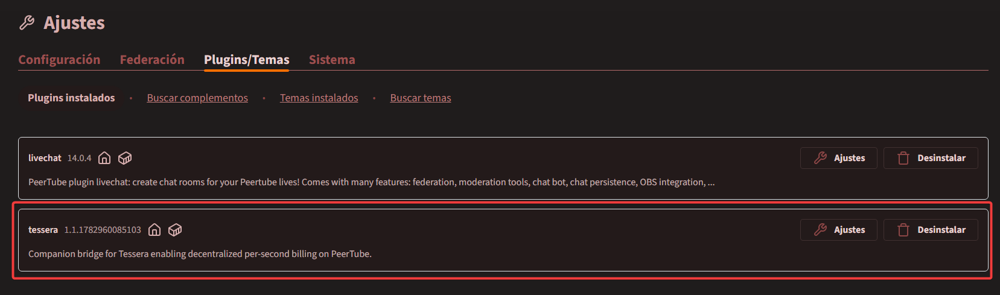
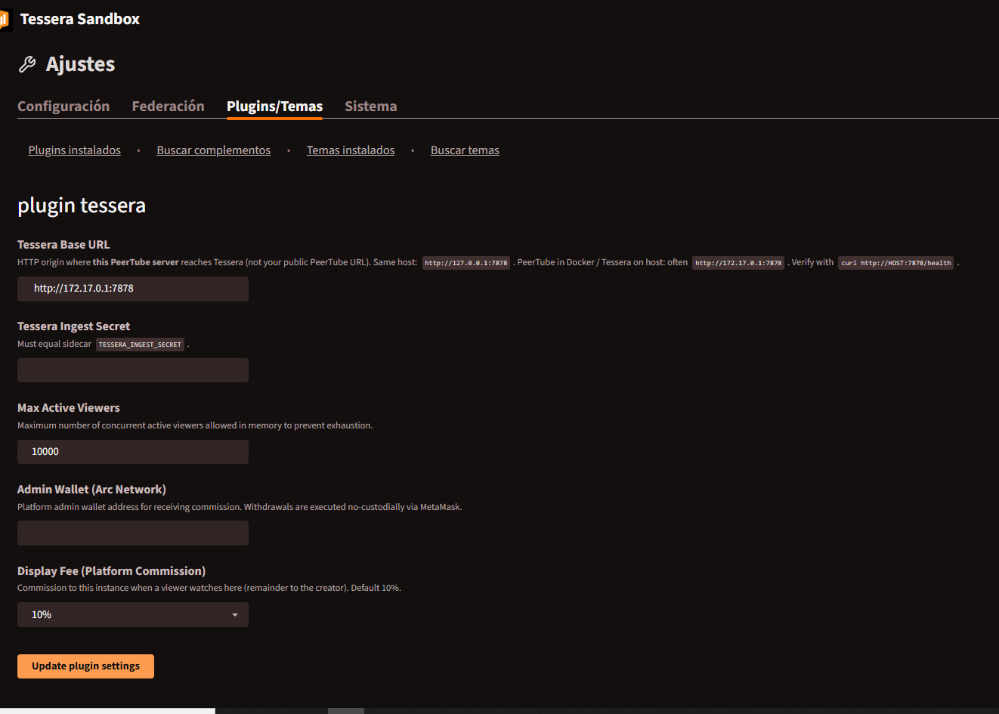
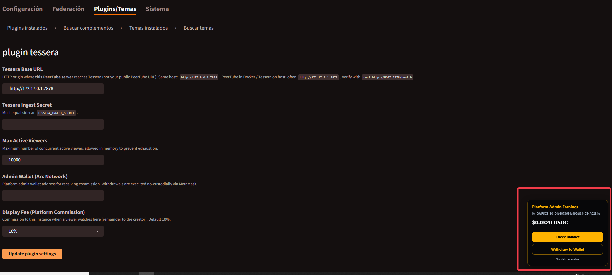
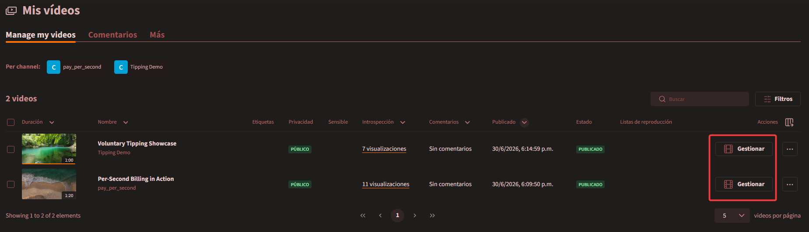
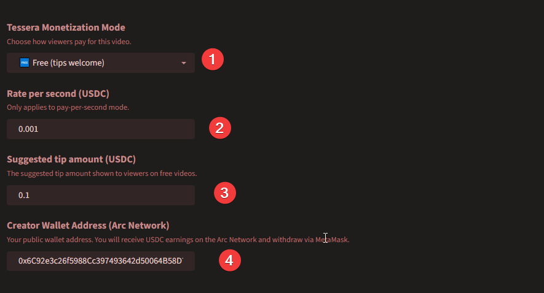
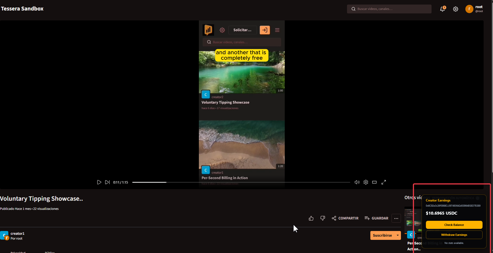

# Tessera for PeerTube

<div align="center">

[](https://github.com/JaDi03/peertube-plugin-tessera/actions/workflows/ci.yml)
[](LICENSE)
[](https://joinpeertube.org)
[](https://nodejs.org)
[](https://github.com/JaDi03/tessera)

</div>

<p align="center">
  <b><i>PeerTube plugin for creator support: tips on free videos, pay-per-second on exclusive videos.</i></b>
</p>

> **TL;DR:**
> `peertube-plugin-tessera` connects a self-hosted [PeerTube](https://joinpeertube.org) instance to a [Tessera](https://github.com/JaDi03/tessera) sidecar. **Exclusive** videos: per-second overlay in the player. **Free** videos: no lock, manual tips. This README is install and settings for the plugin. Sidecar: [Getting Started](https://jadi03.github.io/tessera/getting-started/). Contract: [Connector spec](https://jadi03.github.io/tessera/connectors/spec/) (`CONNECTOR_SPEC.md`). Modes: [Payment models](https://jadi03.github.io/tessera/payment-models/).

---

## Table of Contents

- [What this plugin does](#what-this-plugin-does)
- [Prerequisites](#prerequisites)
- [Install and activate](#install-and-activate)
- [Plugin settings](#plugin-settings)
- [Creator support](#creator-support)
- [What the viewer sees](#what-the-viewer-sees)
- [Verification checklist](#verification-checklist)
- [How it talks to Tessera](#how-it-talks-to-tessera)
- [License](#license)

---

## What this plugin does

- **Exclusive (pay-per-second):** `ArcCashier.initPaywall`. Overlay on the PeerTube player until the viewer funds Gateway and unlocks. Play sends HMAC `sessions/start`; leave / pause / end sends HMAC `sessions/stop`.
- **Free (tips):** `ArcCashier.initTipMode(creatorWallet, amount)`. No lock. The viewer taps tip; the paywall POSTs `/api/core/v1/tips`. This plugin does not HMAC `sessions/start` for free videos.
- Loads Tessera UI through this plugin's relay (`/plugins/tessera/router/assets/...` and `/plugins/tessera/router/api/core/*`), so the browser stays on the PeerTube origin.
- Instance **admin wallet** and **display fee** map to Tessera `splits` on exclusive `start` (remainder to the creator `payoutAddress`).
- Creator earnings and platform-admin earnings widgets call Tessera `GET /api/core/creator/balance` (and withdraw routes) via this plugin.

Tessera wallets, Gateway, and `/health` live on the sidecar. Point this plugin at a running Tessera instance. Circle keys stay in Tessera `.env`.

---

## Prerequisites

- A PeerTube instance **6.0.0 or newer**.
- Node.js **22** if you build the plugin from this repo (see `.nvmrc`).
- A running [Tessera sidecar](https://github.com/JaDi03/tessera) (default port `7878`). Follow [Getting Started](https://jadi03.github.io/tessera/getting-started/) for sidecar install and `.env`. Confirm:

```bash
curl -sS http://127.0.0.1:7878/health
```

Expect JSON with `"status": "healthy"` (see [Getting Started](https://jadi03.github.io/tessera/getting-started/)).

---

## Install and activate

### Option A: Docker helper script

From this repository, with a PeerTube container running:

```bash
git clone https://github.com/JaDi03/peertube-plugin-tessera.git
cd peertube-plugin-tessera
chmod +x update-plugin.sh
./update-plugin.sh
```

The script builds a tarball, installs it inside the PeerTube container, and restarts that container. Override the container name with `PEERTUBE_CONTAINER` if detection fails.

### Option B: Web UI tarball

```bash
git clone https://github.com/JaDi03/peertube-plugin-tessera.git
cd peertube-plugin-tessera
npm install && npm run build
npm pack
```

1. Sign in to PeerTube as an administrator.
2. Open **Administration** > **Plugins/Themes** > **Install**.
3. Upload the generated `.tgz` and install it.
4. Enable **peertube-plugin-tessera** if it is not already active.

<div align="center">
  
  <p><i>Figure 1: Tessera listed under Installed plugins. Open Settings to configure it.</i></p>
</div>

---

## Plugin settings

Open **Administration** > **Plugins/Themes** > **peertube-plugin-tessera**.

Current fields in this plugin:

- **Tessera Base URL:** HTTP origin where **this PeerTube server** POSTs HMAC `sessions/start` and `sessions/stop` (not your public PeerTube URL). Same host: `http://127.0.0.1:7878`. PeerTube in Docker and Tessera on the host: often `http://172.17.0.1:7878`. Same-network Docker: `http://tessera-backend:7878` if you used Tessera `deploy.sh`. Check from that host or container: `curl -sS http://HOST:PORT/health`.
- **Tessera Ingest Secret:** Exact same string as sidecar `TESSERA_INGEST_SECRET`. HMAC only on `start` / `stop`. Never send it to the browser.
- **Max Active Viewers:** In-memory session cap (default `10000`).
- **Admin Wallet (Arc Network):** Instance `0x` address. On exclusive `start` this plugin sends it as Tessera `splits[].address` with label `display-admin`. Needed for the platform earnings widget.
- **Display Fee:** `splits[].fraction` when a viewer watches here: 0%, 10% (default), 20%, or 30%. Remainder goes to the creator `payoutAddress`. Tips have no splits.

Save, then keep Tessera running. Circle API keys and `MASTER_KEY` stay in Tessera `.env`, not here.

<div align="center">
  
  <p><i>Figure 2: Plugin settings. Base URL here is <code>http://172.17.0.1:7878</code> (PeerTube in Docker, Tessera on the host).</i></p>
</div>

On this same plugin page, administrators with an admin wallet see **Platform Admin Earnings** (balance and withdraw).

<div align="center">
  
  <p><i>Figure 3: Platform Admin Earnings on the plugin settings page.</i></p>
</div>

---

## Creator support

On **upload** or **update** of a video, Tessera fields appear on the form:

- **Mode:** Pay-per-second (exclusive) or Free (tips welcome). Exclusive uses `initPaywall` + `sessions/start|stop`. Free uses `initTipMode` + browser tips.
- **Rate per second (USDC):** Exclusive only. Sent as Tessera `ratePerSecond`. This form allows `0.000001` to `0.01` (default `0.001`).
- **Suggested tip amount (USDC):** Passed to `initTipMode` as the default tip. Default `0.10`.
- **Creator Wallet Address (Arc Network):** Tessera `payoutAddress`. Required for pay-per-second. For free tips, set it so tips can go to that address.

The form also shows this instance's display fee (percent to the instance vs the creator).

From **My videos**, open **Manage** on a video to edit those fields.

<div align="center">
  
  <p><i>Figure 4: My videos. Use Manage to edit Tessera fields for that video.</i></p>
</div>

<div align="center">
  
  <p><i>Figure 5: Per-video Tessera fields on upload or update.</i></p>
</div>

When the video owner is logged in on the watch page and a creator wallet is set, a **Creator Earnings** panel shows balance and withdraw (MetaMask, Arc testnet).

<div align="center">
  
  <p><i>Figure 6: Creator Earnings on the watch page (owner view).</i></p>
</div>

---

## What the viewer sees

**Exclusive (pay-per-second):** the Tessera overlay sits on the player (this plugin reparents it into the player box). The viewer signs in through the overlay, funds Gateway, and unlocks. Play then meters at the video rate. Leave, pause, or end sends `sessions/stop`. Unused USDC stays in Gateway (leave does not cash out). Replay on a new video resets the per-video overlay session.

**Free:** no lock. Tip only when the viewer taps. Each tap is `POST /api/core/v1/tips` from the paywall, not ingest HMAC.

Viewers do not need a PeerTube account. Tessera `userId` is the paywall value in `localStorage` key `arc_cashier_user_id` (`email:` or `social:`, legacy `arc_`). The plugin forwards that same id on `start` / `stop`.

---

## Verification checklist

- [ ] Sidecar health: `curl -sS http://127.0.0.1:7878/health` (or your Base URL) includes `"status": "healthy"`.
- [ ] Plugin settings: Base URL and Tessera Ingest Secret saved (secret equals `TESSERA_INGEST_SECRET`).
- [ ] Overlay assets: watch page loads `/plugins/tessera/router/assets/paywall.bundle.js` (and `paywall.css`) with HTTP 200.
- [ ] Exclusive: overlay on the player; after Gateway fund + unlock, play meters; leave/pause sends `sessions/stop`; unused Gateway balance remains.
- [ ] Free: no lock; no HMAC `sessions/start`; tip only when the viewer taps (`/api/core/v1/tips`).
- [ ] Optional: creator or admin earnings panel loads a balance after settled activity.

---

## How it talks to Tessera

Same contract as Tessera [Connector spec](https://jadi03.github.io/tessera/connectors/spec/) and [Payment models](https://jadi03.github.io/tessera/payment-models/).

1. Browser asks this plugin for `/base-url`, then loads `paywall.bundle.js` from the **plugin relay** (`/plugins/tessera/router/assets/...`). Paywall API calls go to `/plugins/tessera/router/api/core/*` (relayed to Tessera). HMAC ingest uses **Tessera Base URL**, not the browser origin.
2. Exclusive, unlocked play: plugin `POST /ping` `{ action: "start" }` then HMAC `POST {Tessera Base URL}/api/core/v1/sessions/start` with `userId`, `resourceId`, `ratePerSecond` (decimal string), `payoutAddress`, and optional `splits`. Leave / pause / end: `{ action: "stop" }` then HMAC `POST .../sessions/stop` with `{ userId }`. Headers: `X-Tessera-Timestamp`, `X-Tessera-Nonce`, `X-Tessera-Signature`.
3. Free: `initTipMode` only. The plugin server skips `sessions/start`. Tips: browser `POST /api/core/v1/tips` (via the relay). No ingest HMAC on tips.
4. Keepalive `ping` every 15 seconds while exclusive playback is active. Tessera meters from `start` until `stop`; keepalive is not a second `start`.

`userId` prefixes, HMAC, and tip body: [Connector spec](https://jadi03.github.io/tessera/connectors/spec/). Sidecar `.env` (Circle, `MASTER_KEY`, `TESSERA_INGEST_SECRET`): [Getting Started](https://jadi03.github.io/tessera/getting-started/).

---

## License

Apache-2.0. See [LICENSE](LICENSE).
